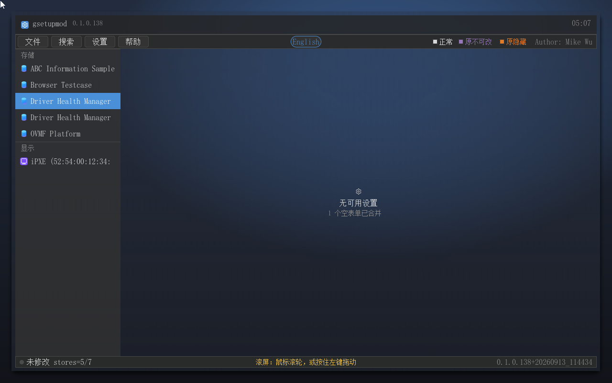
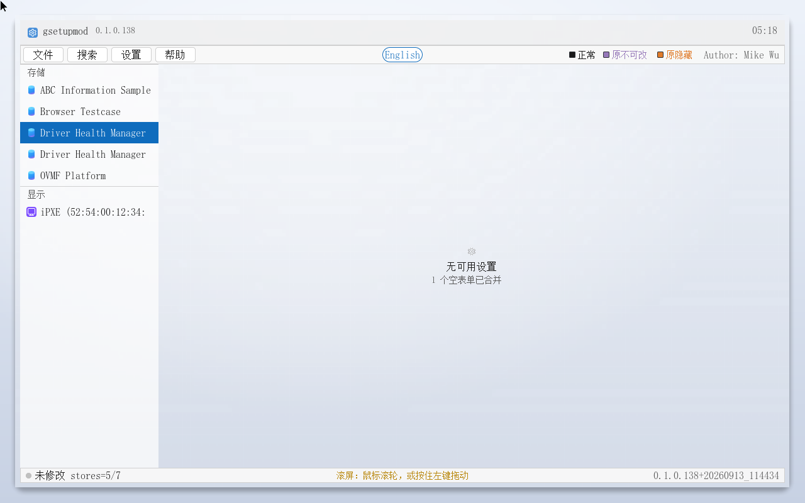
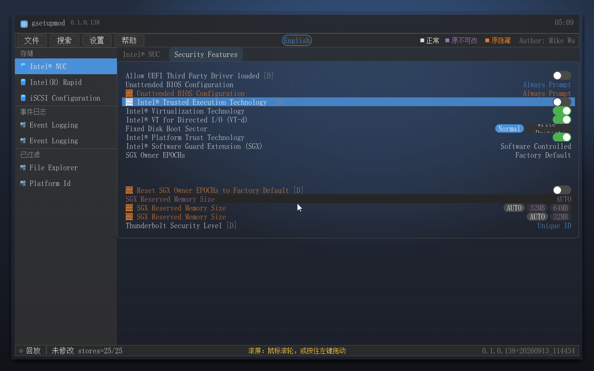
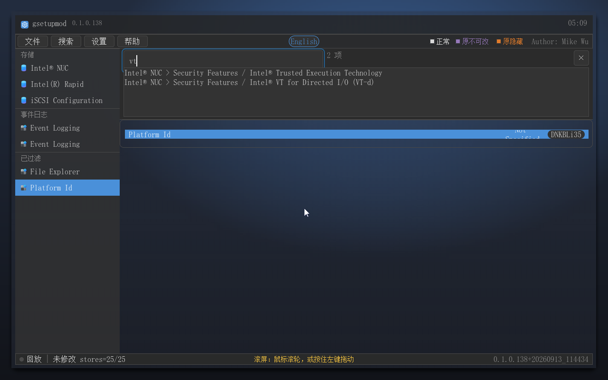
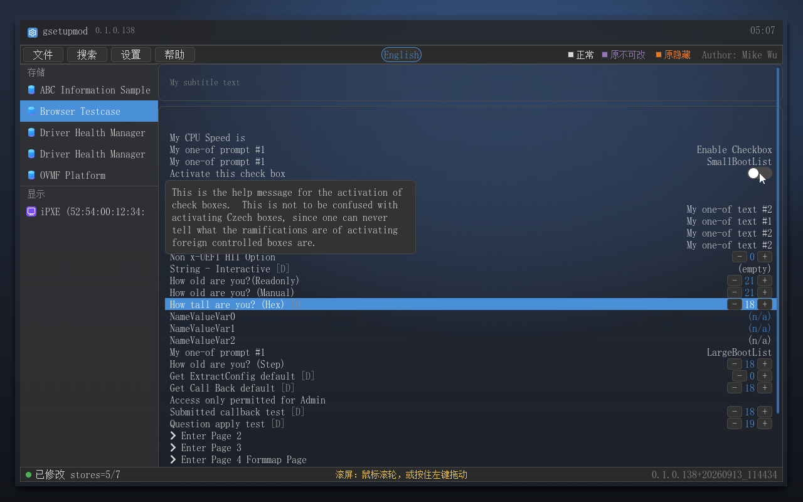
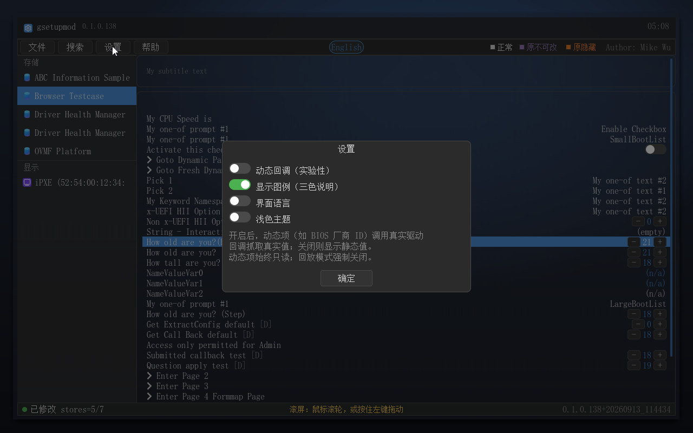
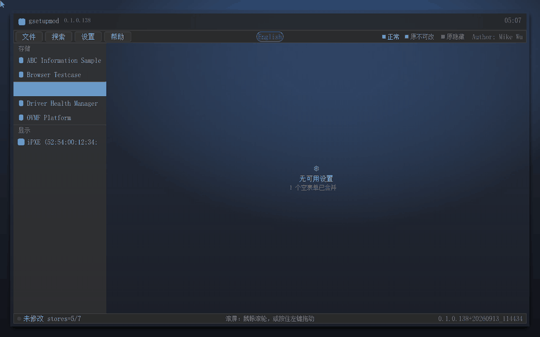

# gsetupmod — 固件设置浏览器：把 BIOS 里被藏起来的选项，全部打开给你看

> **gsetupmod** 是一款运行在 UEFI 固件环境下的图形化固件设置浏览器（原生 UEFI 应用，无需操作系统、不依赖 Shell）。它从运行中的固件里解析全部 HII/IFR 设置数据，以 Windows 11 风格的**毛玻璃**界面重建 BIOS Setup——**包括被固件刻意隐藏的选项**。修改经固件变量接口写回，重启一次生效。
>
> **License**：免费授权个人用户使用；商业使用请联系作者（Author: Mike Wu）。商业用途包括但不限于：商用整机预装、付费服务分发、企业内网部署获利等场景。

## ✨ 重点推荐功能

### 1. 🖱️ 鼠标：**固件没有鼠标驱动，插上鼠标照样能用**

**这一条是本次最大改进。** 多数固件工具在"固件本身不带 USB 鼠标驱动"的机器上（精简固件、部分 ARM 平台、裸跑在虚拟机里的固件）会变成纯键盘工具——鼠标插着也没反应。**gsetupmod 探测不到指针设备时，会自己加载一个内建 USB HID 鼠标驱动**，按标准 UEFI 指针协议发布给界面，插上普通 USB 鼠标即可移动、点击、悬停。

**滚轮也一并接通**：翻长表单不必再按住拖动；不带滚轮的鼠标仍可按住左键拖动滚动。固件自带指针驱动时直接用（两条路径都实现了滚轮 Z 轴解析），状态栏中间的提示写的就是这两条。

### 2. 被固件隐藏的选项——全部展示，还能改

标准 BIOS 只显示"厂商愿意给你看"的那一面：被 `SUPPRESS_IF` 规则隐藏的选项（想开 VT 却找不到入口的经典场景）、被 `GRAY_OUT_IF` 禁用的选项，从数据层面就被抹掉了。gsetupmod 对隐藏规则按真实 IFR 字节求值，三种颜色一目了然：

| 颜色 | 语义 |
|---|---|
| 白 | 正常设置，可修改 |
| 紫 | 固件中原本不可改（灰显），值可读 |
| 橙 | 固件中原本隐藏（SUPPRESS_IF），▓ 标记，可浏览可修改 |

图例常驻菜单栏右上角。真机 NUC 数据实测：`Intel® Trusted Execution Technology`、`SGX Reserved Memory Size` 等标准 Setup 中不存在的项全部呈现。

### 3. 搜索——"想开 VT 找遍 BIOS 没有"？搜 "VT"，两秒直达

`Ctrl+F` 打开搜索面板，输入即过滤（大小写不敏感），**隐藏项同样可搜**，回车跳转目标行并 ACCENT 闪烁定位。NUC 真机数据输入 "VT" 立即命中「Intel® Trusted Execution Technology」与「Intel® VT for Directed I/O (VT-d)」。

### 4. 悬停 1 秒——每个选项自带说明书

设置项的固件帮助文本（范围、含义、警告）做成**悬停 1 秒弹出的小气泡**，移走即消失，不拦截点击。

### 5. 深 / 浅两档毛玻璃外观（新）

界面是 Win11 风格的**毛玻璃**：主窗体四周留边、浮在按运行时分辨率生成的渐变壁纸之上，铬面（品牌条 / 菜单栏 / 状态栏 / 左栏 / 页签条）半透明、内容区只留极淡底色，壁纸的渐变与模糊整个透出来。**深色（默认）与浅色两档**整档切换（壁纸、玻璃叠色、文字与标记色），选择写入配置文件 `\gsetupmod.cfg`，重启后生效。对话框与弹层的进出场还带**转场动效**（按对象类型选不同效果）。

## 🚀 下载与使用

- **Release 下载**（推荐）：https://github.com/MikeWuPing/gsetupmod/releases —— 含
  - `gsetupmod.efi`：应用本体（x64 的 UEFI 二进制）；`gsetupmod-aarch64.efi`：ARM64 版；
  - `gsetupmod-boot-<版本>.iso`：**双架构 U 盘启动 ISO（Ventoy 兼容）**——内置引导 ESP 适配 Ventoy/VMware/真机：拷进任何 FAT32 U 盘（`EFI` 目录在盘根）或直接刻盘；**使用 Ventoy 启动时必须选「正常模式」（Normal Mode），GRUB2 模式不受支持**；
  - 中文说明书（Word，简版 + 详版；在线 Markdown 见下方「文档」）。
- **使用步骤**：
  1. 进入 BIOS/UEFI 设置，**关闭 Secure Boot**（安全启动会拒载未签名镜像；用后建议恢复）；
  2. 从 U 盘/ISO 启动（UEFI 模式），固件直接加载应用，几秒进入界面；
  3. 左栏选表单 → 悬停看帮助 → `Ctrl+F` 搜索 → 改完「文件 → 保存并退出」→ 重启生效。
- 完整演示动图（32 帧：启动 → 表单 → 隐藏项 → 悬停帮助 → 搜索跳转 → 设置与动态回调 → 快照/导出 → 载入真机环境回放 → 编辑弹层 → 写回 → 浅色档收尾）：

## 📚 文档

| 文档 | 说明 |
|---|---|
| [产品说明书（详版）](docs/manual/gsetupmod-产品说明书-详版.md) | 面向进阶用户与固件工程师：架构、三色语义、全部功能、深浅主题与鼠标支持、分辨率自适应、FAQ |
| [产品说明书（简版）](docs/manual/gsetupmod-产品说明书-简版.md) | 面向普通用户的功能图文速览 |

（Word 版见 Release 附件。）

## 📋 主要特性

- **鼠标全支持**（本次重点）：**固件无鼠标驱动时由内建 USB HID 驱动接管**；滚轮滚动；无滚轮可按住左键拖动；
- **毛玻璃界面 + 深/浅两档主题**（选择持久化到 `\gsetupmod.cfg`），对话框与弹层带转场动效；
- **完整 HII 枚举**：汇总全部固件驱动注册的设置表单，几十个 formset 一个界面；
- **隐藏项展示+修改**（独家）、三色语义、真实 IFR 表达式求值；
- **全量搜索**（隐藏项可搜）、**悬停帮助**；
- **图形化编辑**：勾选滑轨 / 单选胶囊与列表 / 数值步进器 / 文本面板，鼠标键盘双通道；
- **按需写回**：只写实际改过的变量（未改动整体跳过），逐项报告，`Security Violation` 点名；
- **快照与 .gus**：全量快照一键恢复；整机 HII 环境导出成 `.gus` 文件，任何机器载入回放（离线分析、回放禁写）；
- **X64 / AArch64 双架构**：同一份源码构建，启动介质同时带 `BOOTX64.EFI` 与 `BOOTAA64.EFI`；
- **分辨率自适应**：力争 ≥1280×800，高分屏上界面铺满可用区（不留大片空白），低分辨率降级提示；
- **无需 Shell**：固件直启 `EFI/BOOT/BOOTX64.EFI`，没有 Shell 的机器一样能跑；
- 右上**版本**与**作者标识**（Mike Wu）常驻界面。

## ⚠️ 注意事项

- **Secure Boot**：未签名镜像需关闭安全启动（上表步骤 1）；
- **部分变量被固件锁定**：`SetVariable` 返回 `Security Violation` 的项会逐名报告——那是固件有意保护（如 OEM 变量），不是写坏；
- **改动生效时机**：多数设置变量由固件启动阶段读取，写回后重启一次生效；
- **免责**：修改固件设置有一定风险，请在快照备份后操作；作者不对错误修改造成的硬件/数据损坏负责。

## 🤝 联系与授权

- 作者：**Mike Wu**
- **免费授权个人用户使用**；商业使用（商用整机预装、付费服务、企业部署获利等）请先联系作者获取授权。
- 建议、BUG 反馈与"想开某个选项却找不到"的机器型号，欢迎到 [Issues](https://github.com/MikeWuPing/gsetupmod/issues) 提交。

## 兄弟项目

- [gudumpinfo](https://github.com/MikeWuPing/gudumpinfo) —— 图形化 UEFI 系统信息查看器（Handle/Protocol/PCI/ACPI/SMBIOS/CPUID…）
- [UEFI_Test_Suite](https://github.com/MikeWuPing/UEFI_Test_Suite) —— UEFI 硬件诊断工具套件
- [guedit](https://github.com/MikeWuPing/guedit) —— UEFI Shell 下的图形化文本编辑器（LVGL）
- [gufile](https://github.com/MikeWuPing/gufile) —— UEFI Shell 下的 GUI 文件管理器（Explorer 式界面）
- [mount](https://github.com/MikeWuPing/mount) —— UEFI Shell 挂载工具：NTFS/ext4/ISO 卷挂载与 ISO 虚拟块设备

---

## English Summary (英文摘要)

**gsetupmod — a UEFI firmware settings browser that shows you every option your BIOS hides.**

- **Mouse always works — even when the firmware ships no mouse driver.** When no pointer device is found, gsetupmod loads its own built-in USB HID mouse driver and publishes it as a standard UEFI pointer, so an ordinary USB mouse just works; the **scroll wheel** is wired through as well (drag-to-scroll still there for wheel-less mice).
- Native UEFI application: no OS, no Shell — the firmware loads `EFI\BOOT\BOOTX64.EFI` (or `BOOTAA64.EFI` on ARM64) directly from a FAT32 USB stick/ISO.
- Rebuilds the whole BIOS Setup from the firmware's live HII/IFR data, **including items the firmware hides** (orange `▓`) or disables (purple) — all readable and modifiable.
- **Frosted-glass UI with dark and light theme packs** (persisted to `\gsetupmod.cfg`), plus entry transitions for dialogs and overlays.
- **Ctrl+F search** indexes everything (hidden items too): type "VT" to jump straight to Intel Virtualization Technology even if the standard Setup never shows it.
- **Hover 1 s** to see each option's own firmware help text.
- **Write-back only what you changed**; per-item error report (firmware-locked variables are named, e.g. `Security Violation`); full snapshot & `.gus` env export/replay for offline analysis.
- **X64 / AArch64** from the same sources; boot media carries both. Resolution-adaptive (≥1280×800, fills the available area on high-resolution screens, graceful fallback below 800×600).
- **License**: free for personal use; **commercial use requires contacting the author (Mike Wu)**.
- ⚠️ Secure Boot must be OFF (unsigned image).

## Sister Projects

The developer's other UEFI series tools:

- [gsetupmod](https://github.com/MikeWuPing/gsetupmod) — Firmware settings browser: rebuild BIOS Setup by parsing HII/IFR, exposing hidden options
- [UEFI_Test_Suite](https://github.com/MikeWuPing/UEFI_Test_Suite) —— UEFI hardware diagnostics, testing and repair-assist tools
- [guedit](https://github.com/MikeWuPing/guedit) — GUI text editor for UEFI Shell (LVGL)
- [gufile](https://github.com/MikeWuPing/gufile) — GUI file manager for UEFI Shell (Explorer-style)
- [mount](https://github.com/MikeWuPing/mount) — UEFI Shell mount tool: NTFS/ext4/ISO volume mounting and ISO virtual block devices

---

[产品说明书（详版）](docs/manual/gsetupmod-产品说明书-详版.md) · [产品说明书（简版）](docs/manual/gsetupmod-产品说明书-简版.md) · [Releases](https://github.com/MikeWuPing/gsetupmod/releases)
