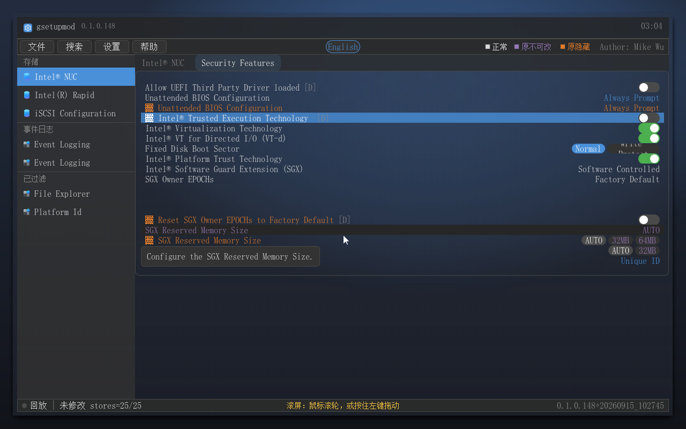
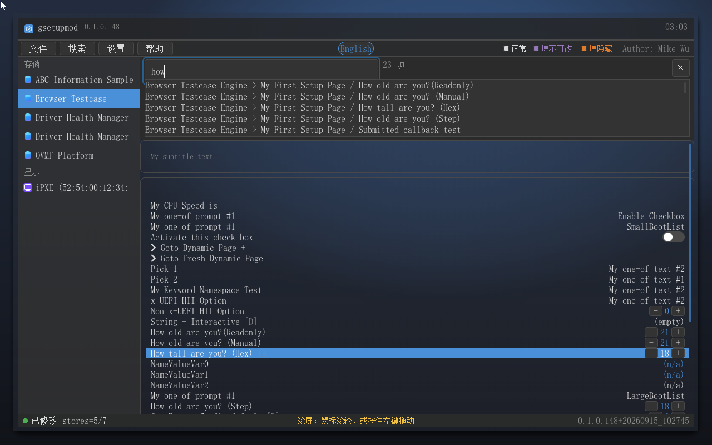
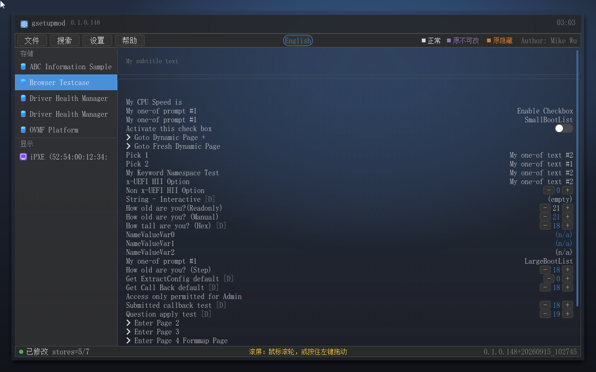
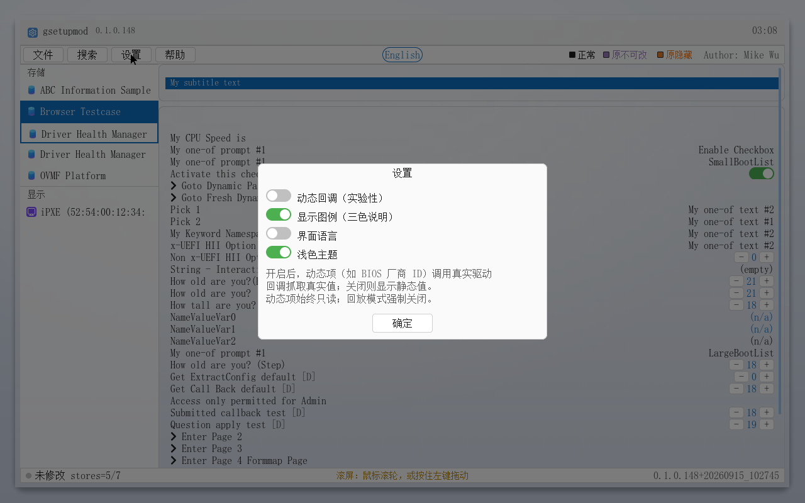

# gsetupmod 产品说明书（详版）

适用于 BUILD 148（0.1.0.148）｜目标读者：进阶用户、固件工程师

---

## 一、前言

### 1.1 为什么需要 gsetupmod

BIOS 的 Setup 界面并不是固件里画好的一张静态图片，而是由一套叫 HII（Human Interface Infrastructure）的数据结构在启动时动态生成的：每个 DXE 驱动把自带的表单（FORM package，内含 IFR 字节码）和文案注册进 HII 数据库，SetupBrowser 再把它们渲染成你看到的菜单。这套机制的展示权完全握在固件手里——被 `SUPPRESS_IF` 表达式判为"条件成立"的菜单项，标准 SetupBrowser 会**直接不显示**；被 `GRAY_OUT_IF` 判为"禁用"的项，普通界面一字不改但就是不给改；那些 OEM 预留给调试的隐藏项、被某个开关条件性隐藏的功能项，普通用户永远看不到，也就永远改不了。而想修改任何一项可见设置，代价是一次完整的重启进 BIOS、找到对应的页面、保存后再重启回来——改两个参数就得来回重启两三次。

更常见的是另一种场景：想开某个功能（比如 Intel VT 虚拟化），翻遍 BIOS 所有页面都找不到入口——不是没有这个选项，而是它被固件藏起来了、或者藏在某个不起眼的深层页面里。gsetupmod 正是为解决这些痛点而生的：它运行在固件环境里，通过标准 `EFI_HII_DATABASE_PROTOCOL` 把运行中固件**全部** formset 汇入一个图形界面，以 Windows 11 风格的毛玻璃 UI 重建 Setup 体验（默认深色，可切浅色）。与标准 Setup 的关键区别在于——固件隐藏的项也会展示出来（橙色标记），固件禁止修改的项如实标记（紫色）但仍可读，悬停或搜索即可找到；修改经 `SetVariable` 直接写回 NVRAM，重启一次即生效；它甚至能把真机的 HII 环境导出成文件带走离线分析。

### 1.2 功能演示

上图（32 帧 GIF，约 27 秒）演示了完整交互闭环：启动 → 进表单 → 行内控件（滑轨/胶囊）→ 下钻看隐藏项与置灰项 → 悬停帮助 → 搜索 "how" 命中并跳转 → 设置对话框（含动态回调）→ 快照与 .gus 导出 → 载入真机环境回放、搜 "VT" 跳转定位 → STRING / ONE_OF 编辑弹层 → 保存并写回；末段切到浅色档，同一套界面换亮色玻璃。

### 1.3 它解决的核心问题

- **隐藏项不可见、不可改**：被固件 SUPPRESS_IF 抑制的配置在标准 Setup 里直接消失，gsetupmod 按真实 IFR 字节求值后以橙色 + ▓ 标记全部呈现，且可正常编辑写回。
- **反锁功能找不到入口**：想开 VT / SGX / TPM 等能力，翻遍 BIOS 却找不到项——它很可能被隐藏了。gsetupmod 的搜索输入几个字母即直达（隐藏项同样入索引），悬停还能看到固件原文帮助。
- **反复重启的调参成本**：无需进 BIOS，改完一次性写回，重启一次生效（也可以做成 USB 启动盘在裸机前改好）。
- **动态项只见占位**：由驱动回调动态填充的值（如 BIOS 厂商 ID）在多数 HII 工具里只显示静态占位，gsetupmod 主动调用驱动 `ConfigAccess->Callback(RETRIEVE)` 抓真实值。
- **真机环境带不走**：`.gus` 环境快照把整机 HII 环境（含动态值）导出为文件，任何地方都能载入回放、离线分析。
- **误改无退路**：内置 `\GSETUPMOD.SNP` 全量快照，改坏配置可一键恢复。

---

## 二、运行环境与启动

### 2.1 运行环境

gsetupmod 是标准的 UEFI 应用（UEFI_APPLICATION），需要固件已进入 DXE 阶段、HII 数据库协议可用。**它不依赖 Shell**——固件 Boot Manager 可直接加载 `EFI\BOOT\BOOTX64.EFI` 直启（QEMU 取证流即为此路径）；也可以用 `startup.nsh` 让 Shell 环境自动加载，两种方式等效。显示走 GOP 图形输出，**分辨率自适应**：启动时枚举全部 GOP 模式，力争切到 ≥1280×800 的最小达标档；没有达标模式时保持当前模式（低于 800×600 弹橙色提示条）；界面**铺满可用区**（高分辨率屏上不留大片空白，见 4.13）。输入方面键盘完全支持，鼠标为可选增强——固件自带鼠标驱动时直接用，**固件没有鼠标驱动时应用自带一个**（见 4.15）。

### 2.2 启动步骤

**方式一：U 盘 / 启动 ISO（推荐给普通用户）**

1. 运行 `tools\New-BootIso.ps1` 生成 `dist\gsetupmod-boot-<version>.iso`（ISO9660+Joliet+RR+UDF 桥 + 内嵌 ESP 的双保险结构，**Ventoy 兼容**；同一张盘带 `BOOTX64.EFI` 与 `BOOTAA64.EFI`，x86 与 ARM 平台都能引导），或直接把 ISO 内容拷进任何 FAT32 U 盘（`EFI` 目录在盘根）。
2. BIOS/UEFI 设置中从该介质启动（UEFI 模式），固件直接加载 `EFI\BOOT\BOOTX64.EFI`（ARM 平台自动用 `BOOTAA64.EFI`）——无需操作系统、无需 Shell。
3. **Secure Boot 须为关闭状态**：本镜像未签名，安全启动开启时固件会拒载。请在 UEFI 设置的 Security/Boot 页先关闭（各厂商入口不同），使用后建议恢复。ISO 内附 README.txt 面向最终用户重复这些步骤。

同一份镜像在 ARM64（AArch64）平台上同样可用——固件自动取 `BOOTAA64.EFI`：

4. **Ventoy 用户注意**：把它拷进 Ventoy U 盘使用，引导菜单中必须选**「正常模式」（Boot in normal mode）**；**GRUB2 模式不受支持**（对非标 ISO 为 Ventoy 已知限制），选错会导致无法引导。

**方式二：Shell 手动加载**

1. 把 `gsetupmod.efi` 复制到任意 FAT 卷，例如 `fs0:\`。
2. 在 UEFI Shell 中执行 `fs0:\gsetupmod.efi`；也可以把该命令写进卷根目录的 `startup.nsh`，让 Shell 启动时自动加载。
3. 应用启动即枚举全部 HII package list 并重建表单树，界面就绪即可浏览；品牌条显示版本号。
4. 需要退出时，在导航栈顶（栈深 1）按 ESC，或使用菜单栏「文件 → 退出」；若有未保存修改会先弹确认对话框。

### 2.3 启动参数 -Dyn

`-Dyn` 是动态回调开关：`gsetupmod.efi -Dyn` 开启后，应用会对带 `EFI_IFR_FLAG_CALLBACK` 标志的动态问题调用真实固件驱动的 `ConfigAccess->Callback(RETRIEVE)` 抓取真实值显示。该开关**默认关闭**（此时动态项显示 IFR 静态值），也可以在界面「设置」对话框中随时切换、即时生效，无需重启应用；回放模式下强制关闭。BUILD 121 起重新裁决：CALLBACK 问题**恢复可编辑**（标准 UEFI Setup 语义），只读拦截仅保留给 varstore 不可读的行（无静态存储/读值失败——改它只会把零快照写回固件）。

---

## 三、界面总览（五大区域）

上图是应用启动后的完整主界面，自上而下由五个区域构成。

**品牌条**（顶部 40px 深色条）：左侧是彩色 logo、应用名称与版本小字，右侧是实时时钟（RTC 双源读取）。它承担"身份与时间"两个职能：一眼确认正在运行的是哪个版本，时钟为取证和截图留痕提供参照。

**菜单栏**（30px）：左侧为「文件」按钮（含保存并退出、另存为快照、从快照载入、导出/载入 HII 环境、放弃修改、退出等命令），其后是「搜索」「设置」「帮助」按钮；**右端固定署名 Mike Wu**，其左侧是三色图例——「■ 正常 / ■ 原不可改 / ■ 原隐藏」，一眼看懂颜色语义，可在设置里关闭显示。

**左栏分组导航**：宽度 220px，所有 formset 按 Class 归入「系统 / 存储 / 显示 / 网络 / 输入 / 其他」分组，组内按标题排序，任意数量的 formset 都可以滚动到达。它的价值在于：数十个 formset 全部汇入一个界面后，仍然有清晰的入口层级。

**表单区**（左侧栏之外的全部中部区域）：顶部是次级页签条（只列一级 form，详见 4.4），表单以 subtitle 分组的卡片形式渲染，值区按类型着色（勾选绿、数值蓝、普通白）。鼠标滚轮或键盘方向键驱动滚动。

上图即表单区的常态：卡片只留一层极淡的底色，壁纸的渐变与模糊透上来，行文字与值区控件仍保持可读对比度。

**状态栏**（底部 24px）：左侧是圆点加状态词——「○ 未修改」/「● 已修改」（圆点随 Dirty 状态灰绿切换），回放模式下前缀「回放 |」；中间常驻操作提示「滚屏：鼠标滚轮，或按住左键拖动」；右侧是版本串。让"是否有未写回的改动"常驻可见，避免误以为已保存。

**窗口留边与毛玻璃**（BUILD 134/135/138）：主窗体四周留出一圈边距，窗体像一扇浮在壁纸上的圆角卡片（带投影），外面那圈壁纸与卡片边缘之间就是"玻璃环"。窗体本身是**毛玻璃**——程序按运行时分辨率生成一张渐变壁纸，另算一份降采样模糊图，再叠一层半透明色调合成；界面里**铬面**（品牌条、菜单栏、状态栏、左栏导航、页签条）半透明、**内容区**（表单卡片）只留极淡的一层底色，于是壁纸的渐变与模糊在整个界面下透出来，而文字对比度仍按正文可读性（WCAG AAA 7:1）标定。深浅两档各有自己的壁纸、叠色与铬面不透明度（见 4.14）。

高分辨率屏幕上，界面**铺满**卡片可用区（不再按 1280×800 居中），窗口边界与卡片边界重合，只有那一圈留边是刻意的（见 4.13）。

**动效**（BUILD 134）：对话框与弹层的进出场都带 300ms 转场，且按对象类型选不同的效果——结果/确认类弹层用**弹出**（缩放 + 淡入）、设置与文件对话框用**上滑**、搜索面板用**左右推入**、编辑弹层从**触发它的那一行位置放大**（位置连续，眼睛不用重新找目标）。转场只是观感层：对象几何在动画开始前就已定稿，键盘/鼠标事件不受影响（取证脚本按坐标注入点击也因此稳定）。

---

## 四、功能详述

### 4.1 完整 HII 枚举

gsetupmod 启动时经 `EFI_HII_DATABASE_PROTOCOL->ExportPackageLists` 枚举全部 package list，解析 formset / form / question 五类交互控件（ONE_OF / NUMERIC / CHECKBOX / STRING / DATE / TIME）以及 GOTO / REF 导航节点，并支持真实 VfrCompile 产物的**后置式表达式求值**——`EQ_ID_VAL`、`EQ_ID_ID`、`EQ_ID_VAL_LIST`、QREF1、AND-OR-NOT 等一应俱全。OVMF 实测将全部固件配置表单汇入一个界面。

**它解决什么问题**：标准 Setup 只渲染当前要展示的页面，数据虽在 HII 库里却支离破碎。完整枚举把全部表单数据汇聚成一份统一视图——没有全量枚举，隐藏项展示、搜索、导出都无从谈起。

### 4.2 隐藏项展示（独家能力）

被固件 `SUPPRESS_IF` 表达式判为"条件为真"的菜单项，标准 SetupBrowser 直接不显示。gsetupmod 对每个问题按**真实变量值 + 真实 IFR 字节**求值，凡被抑制的项一律正常渲染，标题加 **▓ 前缀**、整行套 **橙色**，且可以像普通项一样编辑。实测 OVMF 的 formmap 表单内 2 行隐藏（橙色）、1 行置灰，状态随变量值实时重求值——改掉触发条件，隐藏状态立刻联动。

**三色语义**（菜单栏右上角图例同步说明）：
- **白色 = 正常**：标准值，可查看可修改；
- **紫色 = 原不可改**：固件 `GRAY_OUT_IF` 置灰的项（如条件未满足的英特尔 AMT/DTK 配置），固件里可见但禁改——这里如实标记、值可读；
- **橙色 = 原隐藏**：固件 `SUPPRESS_IF` 抑制的项——标准界面根本不存在。

在 NUC 真机数据的 Security Features 表单里，橙色行（`Unattended BIOS Configuration`、`Intel® Trusted Execution Technology`、`SGX` 相关项……）在标准 Setup 页面里根本不出现；gsetupmod 把它们全部展示出来，且文本正常、值可读。

**它解决什么问题**：OEM 调试项、被功能开关条件性隐藏的配置，在标准 BIOS 界面里永远不存在。这些项恰恰是进阶用户最想动的地方——隐藏项可见可改，是 gsetupmod 最核心的差异化能力，别的软件没有。

### 4.3 置灰项语义

`GRAY_OUT_IF` 置灰项以**紫色（原不可改）**显示、值可读、不可编辑、焦点永不落灰项（Tab 循环自动跳过）——BUILD 106 起与正常白色的区分从深灰改为色相分离的紫色（THEME_READONLY 0x9678B9），避免"看不清哪项能改"。

**它解决什么问题**：置灰不是隐藏——标准界面同样展示灰项，只是禁止操作。gsetupmod 如实呈现"可见但不可用"的状态，让用户看清为何不可用，而不是像隐藏项那样凭空消失。

### 4.4 层级导航

页签条只列**一级 form**（入口 form + 无 GOTO/REF 指向的孤儿 form）；二级 form 经行内 **▸ 前缀的 GOTO/REF 行**点击进入，进入后页签条末尾追加**临时页签**并高亮当前 form，导航栈随之压栈。

回退有两条路：按 **ESC** 逐级弹栈，或点击画面 **「← 返回」按钮**（栈深大于 1 时出现在横幅区左端的圆形按钮，栈深 1 时不渲染）。跨 formset 的 `EFI_IFR_REF` 跳转一并支持，跳转时完整切换表单上下文，弹栈回退同样成立。被抑制的 form 不进页签，但只要被 GOTO/REF 指向，仍可经行点击进入探索。BUILD 122 起：下钻态点击自己的临时页签**不再清空下钻栈**（同 form 短路由），ESC 仍逐级回退。

**它解决什么问题**：formset 里几十个 form 平铺成页签不可维护；对齐标准 SetupBrowser 的"一级可见、二级经行进入、ESC 回退"心智模型，既符合固件工程师的习惯，又让隐藏 form 依然可达——层级清晰与探索自由兼得。

### 4.5 动态项回调（独家能力）

带 `EFI_IFR_FLAG_CALLBACK`（0x04）标志的问题（如 BIOS vendor ID、驱动动态维护的展示项）在标准浏览器中由驱动的 `ConfigAccess->Callback(RETRIEVE)` 实时填充。gsetupmod 开启动态回调后，会按 varstore GUID+Name 匹配驱动实例，对每个动态问题调用 RETRIEVE 抓真实值显示，失败时回退静态值。动态行以暗色 **「D」角标**标记；BUILD 121 起**可编辑**（标准 Setup 语义）；仅 varstore 不可读的行保持只读（无静态存储/读值失败——改它只会把零快照写回固件）。

开启方式有两种：启动参数 `-Dyn`，或界面「设置」对话框中的动态回调开关（详见 4.13）。该功能为**实验性**：UEFI 没有异常隔离机制，真实驱动回调若崩溃会导致整机挂死，因此默认关闭。

**它解决什么问题**：多数 HII 工具对动态项只显示 IFR 静态占位，你看到的"值"从来不是固件实际使用的值。主动调用 RETRIEVE 才能拿到驱动眼中的真实状态，排查"值对不上"类问题就有了可靠依据。

### 4.6 图形化编辑控件

四类编辑控件各有专攻，均支持鼠标与键盘双通道：

1. **CHECKBOX**：行内 toggle 开关（滑轨动画），点击滑轨或按 Space/Enter 翻转，无需进入弹层。

2. **ONE_OF**（选项数 ≤ 3）：值区渲染为胶囊分段控件，点击目标段即切换；选项更多时按 Enter/点击打开选项列表弹层。

上图：选项超过 3 项时打开的列表弹层（当前项以强调色标出），点选即提交。

3. **NUMERIC**：行内 `[-] 值 [+]` 步进器；按 Enter 打开数值弹层（显示 min/max/step 与当前值，退格清空后输入新值，OK 提交）。

4. **STRING**：按 Enter 打开文本输入面板（当前仅支持 ASCII 输入），确认后提交。

任何修改立即写入内存模型并**全量重求值**全部表达式，界面同步刷新——某个值一变，受它条件控制的其它项进出隐藏/置灰状态立刻可见。所有改动先落在内存（Dirty 标记），统一在「保存并退出」时写回。

**它解决什么问题**：Setup 编辑的本质是"值区点击 → 受约束修改"。图形化控件把 ONE_OF 的合法选项、NUMERIC 的 min/max 边界直接可视化，从交互层面杜绝了手输非法值的可能。

### 4.7 悬停帮助 Tip（新）

大部分设置项都带一段固件帮助文本；标准 Setup 把它放在页面某个信息区，看不看得到全看缘分。gsetupmod 改为**悬停选项 1 秒弹出浮动气泡**（Windows 11 惯例时长），移走即消失：

实现细节：LVGL 9 的 HOVER_OVER/LEAVE 事件只在指针"释放"路径派发（纯移动从不触发——实测死代码），因此改经 100ms 定时器巡检指针位置逐行命检；悬停同一行 ≥1000ms 且帮助文本非空才显示；气泡锚定行下方（接近屏幕底缘自动翻转到行上方）、不拦截点击；按下冻结（防点击后停 1 秒误弹影响操作）。帮助文本来源为固件 STRING 包的 HelpToken（回放模式下从 .gus 的字符串包抓取，与搜索索引同源）。

**它解决什么问题**：设置项的含义与范围说明，写了就没有人看——悬停即得的帮助把"说明书"嵌进了每个选项本身，降低试错成本（尤其对自己拼装硬件的用户，help 里的范围约束比 BIOS 里的报错温柔得多）。

### 4.8 搜索

按 **Ctrl+F**（或菜单栏「搜索」按钮）打开搜索面板，输入即实时过滤（大小写不敏感），索引覆盖**全部 formset**（隐藏项同样入索引，灰项、动态项均可命中）。结果列表带 form 路径，点击结果跳转到目标行，并以主题色（ACCENT）**两拍闪烁**提示位置。

**真机实例——搜 VT**：载入 NUC 真机 dump 后输入 "VT"，面板即时命中两条——「Intel® Trusted Execution Technology」与「Intel® VT for Directed I/O (VT-d)」，回车即定位到 Security Features 表单。这正是"想开 VT 找遍 BIOS 却没有"的答案：选项多半在，只是被藏进了深层页面。

**它解决什么问题**：数十个 formset、上千个问题层层嵌套，肉眼翻找如同大海捞针。搜索把"我记得这个名字"直接变成"到达那一行"，尤其对隐藏项——它在标准界面里根本不存在，搜索是唯一入口。

### 4.9 写回（核心价值）

「文件 → 保存并退出」（或 **Ctrl+S**）把修改批量写回：EFI_VARIABLE 存储经 `gRT->SetVariable` 真实写入（保留原 attributes），BUFFER / NAME_VALUE 存储经 ExtractConfig/RouteConfig 链路读写。**仅写回与装载基线不同的变量**——BUILD 118 起启动时给每个可读存储留一份基线快照，保存时字节比对，未动过的存储整体跳过（改一个选项不再全量刷新每个变量），实测日志形如 `save: ok 1 fail 0`。写回结果逐项报告，`EFI_WRITE_PROTECTED`、`EFI_SECURITY_VIOLATION` 等锁定变量错误会单独点名。多数 Setup 变量由固件在启动阶段读取，因此改动在**下次重启后生效**。

写回有严格的 Dirty 门控：无未保存修改时「放弃修改」置灰不可点；「退出」时若有修改，弹三键确认框（保存并退出 / 放弃并退出 / 取消）。

图：存在未保存修改时按 ESC 或「文件 → 退出」弹出的三键确认框（保存并退出 / 放弃并退出 / 取消）。

**它解决什么问题**：改完不落盘等于白改。批量写回 + 逐项报错 + Dirty 门控这条链路，保证"界面所见"与"NVRAM 所存"可核对、可撤销、不误丢——这是整个产品可信度的根基。

### 4.10 快照

「文件 → 另存为快照」把全部 varstore 的当前值写入 `\GSETUPMOD.SNP` 文本文件；「从快照载入」读取该文件并恢复全部存储值，再经保存并退出一次写回固件。

**它解决什么问题**：调参过程越兴奋越容易改出无法启动的组合。快照让"改前存一份、改坏就恢复"成为一条指令的事，适合固件调试这类高风险试错场景。

### 4.11 .gus 环境快照（独家能力）

「文件 → 导出 HII 环境」把**整台机器的 HII 环境**导出为 `.gus` 文件——包括全部 package list 原始字节、当时的变量值，以及 GUS2 格式特有的**动态项抓取值**（DynValues 节，开关开启时逐个 RETRIEVE 抓入）。默认文件名 `HiiSnap_YYYYMMDD_HHMMSS.gus`。

「载入 HII 环境」从文件重建应用进入**回放模式**：整体切换到快照环境，状态栏出现「回放 |」标记；回放**禁写**——保存并退出、从快照载入、导出 HII 环境一律置灰，编辑只进内存不进 NVRAM，避免把外机的数据误写回本机。「退出回放」随时切回活体视图。旧版 GUS1 快照兼容载入（动态项显示占位）。

**它解决什么问题**：真机报障时"现场"带不走——HII 数据、变量值、驱动回调状态都只存在于那台机器的内存里。把环境导出成文件，任何地方都能载入、逐表单离线分析、复现真机所见，这是排障链条上最省时间的一环。

### 4.12 设置对话框

菜单栏「设置」按钮（帮助按钮之前）打开设置对话框，内含四行开关：**动态回调**、**显示图例**、**界面语言**、**浅色主题**（后两项 BUILD 131/134 加入）。

**动态回调**切换**即时生效**：翻转瞬间联动 `HiiDumpSetDynEnabled`（.gus 导出的 DynValues 节随开关抓值），并**原地重载当前表单**重新抓值——在任意 formset 上切换都停留在原浏览位置，不会跳回默认表单。对话框内含说明：开启后动态项调用真实驱动回调抓取真实值，关闭则显示静态值；回放模式强制关闭。

**显示图例**开/关菜单栏右上角那三个色块说明（三色语义见 4.2）。

**界面语言**在中文与英文之间切换（BUILD 129/131）：提示语、菜单、行内的界面文案全部随档切换，固件自带的表单标题与帮助文本仍按固件语言显示（那是 HII 数据，不是界面文案）。与主题一样写进 `\gsetupmod.cfg` 并重启生效。

**浅色主题**即深浅外观切换（详述见 4.14）：翻转后把选择写入设置文件 `\gsetupmod.cfg` 并提示，随后应用退出——外观是全局装配的，重启后整体生效（与语言切换同一套 UX）。

**它解决什么问题**：把实验性能力与全局外观都放在显式开关后面——要真值、要图例、要亮色界面，都由使用者在界面上决定，不必记启动参数。

### 4.13 品牌条 / 时钟 / 分辨率自适应

品牌条（logo + 名称 + 版本小字 + 实时时钟）与状态栏版本串已在界面总览说明。**分辨率自适应**（BUILD 123，BUILD 138 修订）：启动时枚举全部 GOP 模式（QueryMode），若当前模式低于 1280×800 则 SetMode 到最小的达标档（640/1024 的 QEMU 档实测升到 1280×800）；当前已达标则不动；SetMode 失败（UEFI 规范保证失败时保留原模式）即自然降级——低于 800×600 时弹橙色提示条（实测 640x480 触发）。

**界面铺满可用区**：Windows 侧边栏式的"固定 1280×800 居中"在真机高分辨率宽屏上会留下一大片空（窗体一块、卡片一块，中间全空），所以 BUILD 138 起界面**铺满玻璃卡的可用区**：左栏仍 220px、行高仍 19px、菜单与状态栏两端对齐，只有表单区变宽变高（可见行数更多）。1280×800 上可用区是 1216×736，与旧版逐字相同。

（低于下限的橙色提示条只在小屏上才见得到——启动时的模式协商会先把显示顶到 ≥1280×800；QEMU 的显示设备都能做到，因此本版手册不附该提示的截图，真机小屏上启动即见。）

**它解决什么问题**：分辨率适配不是美观问题而是可用性问题——按钮被裁掉一半等于没法用。枚举-力争-降级三级策略把"为什么跑不起来"变成一条看得见的提示，把"跑在 4K"变成铺满而不留空白的界面。

### 4.14 深色 / 浅色主题（毛玻璃双档）

BUILD 134 起界面有**深色（默认）与浅色两档**，整档一起切：壁纸渐变、玻璃叠色、铬面不透明度、全部表面色与文字色、状态标记色（隐藏橙 / 置灰紫）都随档位换一套。深色档是深蓝灰到近黑的烟熏玻璃，浅色档是 Win11 亮色族（浅蓝灰玻璃 + 深色文字）——两档都保持"壁纸退到后面、前景是主角"的对比关系，正文对比度按 WCAG AAA 标定。

切换入口：**设置对话框第三行「浅色主题」**。翻转后立即把选择写进设置文件 `\gsetupmod.cfg`（与语言选择同一个文件），弹提示并退出应用——外观是全局装配的，**重启后生效**。也就是说，把配置文件带在身边，插到别的机器上启动也是你要的那一档。

浅色档表单与设置对话框：

**它解决什么问题**：机房、暗房、强光下办公桌——同一块屏在不同环境里舒服的亮度不一样。深色是长时间盯屏与暗环境的默认，浅色适合投影与强光；既然是固件工具、常常要现场拍照记录，一档可切换的外观比"只有深色"更省事，而且选择会跟着配置文件走。

### 4.15 鼠标支持（滚轮 + 固件无驱动时的内建驱动）

BUILD 134 起鼠标支持覆盖三条通路：

**一、固件自带鼠标驱动时直接用。** 机器固件（或其 UEFI 驱动栈）已提供指针设备协议时，gsetupmod 直接使用它，并把**滚轮**接进来滚动表单——不需要按住拖动。指针对齐、点击、悬停一律照常。

**二、固件完全没有鼠标驱动时，应用自建一个。** 有些固件（尤其精简版固件、部分 ARM 平台、虚拟机上裸跑的固件）根本不带 USB 鼠标驱动，插着鼠标也没反应。gsetupmod 在这种情况下会**自己加载一个内建 USB HID 鼠标驱动**：它按 USB boot 协议接管已插入的 USB 鼠标，装上固件标准的指针协议，再把移动/按键喂给界面。对使用者就是一句话——**插上 USB 鼠标就能用**（串口日志可见 `no real pointer - starting USB HID mouse fallback` → `fallback driver installed`）。

**三、滚轮与拖动两条滚动通路都可用。** 滚轮经指针设备的 Z 轴传入（固件驱动与内建驱动两条路径都实现了）；按住左键拖动滚动仍然有效（对没有滚轮的鼠标）。状态栏中间的提示写的就是这两条：**「滚屏：鼠标滚轮，或按住左键拖动」**。

**它解决什么问题**：固件工具经常要在"裸机、虚拟机、别人的机器"上跑，而这些环境的指针支持参差不齐。自建驱动的意义是**把"这台机器鼠标能不能用"从环境问题变成应用问题**——应用自己搞定，使用者只管插鼠标。滚轮则是纯体验：翻一屏设置要按住拖动几百次，没人愿意。

---

## 五、键盘与鼠标操作速查表

| 操作 | 行为 |
|---|---|
| Tab | **换区**：左栏导航 → 表单区 → 菜单栏 → 回左栏（BUILD 145 起菜单栏走到最后一个按钮再按 Tab 即绕回左栏） |
| Shift+Tab | 反向换区（在菜单栏第一个按钮上按，回表单区） |
| ↑ / ↓ | **区内移动**：左栏里换 formset 条目；表单区里换焦点行；菜单栏里不适用（用 Tab 换按钮）；**展开的菜单下拉里等同 Tab**（见下） |
| Tab（对话框内） | 在本对话框自己的控件之间循环（列表整体算一个 Tab 位，列表**行**用 ↑↓ 走） |
| ← / → | 表单内焦点行首/行尾（编辑弹层内为文本移动） |
| Enter | 激活焦点项：打开编辑弹层 / 进入 ▸ GOTO 行 / 确认对话框；弹层内提交 |
| Space | CHECKBOX 行内翻转（等价 Enter 的行内路径） |
| ESC | 关闭弹层与对话框；导航栈深 > 1 时逐级回退；栈深 1 时退出应用 |
| Ctrl+F | 打开 / 关闭搜索面板 |
| Ctrl+S | 保存并退出（批量写回） |
| 鼠标点击 | 聚焦并激活目标（行、值区、按钮、菜单项、搜索结果） |
| 鼠标滚轮 | 滚动表单（固件驱动与内建兜底驱动两条指针路径都支持） |
| 鼠标左键拖动 | 滚动表单（无滚轮时用） |
| 鼠标悬停 ≥1 秒 | 显示该行固件帮助 Tip（移走消失；按住暂停触发） |
| 鼠标悬停 / 按压 | 目标高亮与按压态反馈 |

行为细则：灰项焦点永不落下；仅 varstore 不可读的行不弹编辑层；栈深 1 时 ESC 退出应用，有未保存修改先弹确认框。

**纯键盘怎么走（BUILD 139 起，145 起补全）**：开机默认焦点落在**左栏**（若当前表单没有可操作的设置项，比如开机落在空表单上），↑↓ 直接换 formset、Enter 切换——不用先按 Tab 找焦点。随后 Tab 依次换到**表单区**（↑↓ 换行、Enter 编辑、Space 翻转勾选、PgUp/PgDn 整页翻）和**菜单栏**（Tab 在文件/搜索/设置/帮助/语言之间换，Enter 打开菜单，ESC 回表单），菜单栏走到最后一个按钮再按 Tab **绕回左栏**——三个焦点区首尾相接成环，任何一区都不会"进得去出不来"。鼠标点到哪里，焦点区就跟到哪里——**ESC 的含义始终跟着你此刻所在的区域**：在左栏是"退回表单区"，在表单里是"返回上级表单 / 退出"。

**弹层里的 Tab**：**展开的菜单下拉**属于列表，Tab 与 Shift+Tab 等同 ↓ 与 ↑（在菜单项之间移动，自动跳过置灰项），ESC 关闭下拉；**对话框**（写回预览 / 关于 / 确认 / 设置 / 搜索面板 / 文件对话框）里的 Tab 只在**该对话框自己的控件**之间循环，不会跑到背后的主界面上，列表整体算一个 Tab 位、列表**行**用 ↑↓ 走——写回预览里按 Tab 到「确定」回车即完成保存（BUILD 147/148 起）。

---

## 六、常见问题与已知限制

### 6.1 常见问题

**Q：改完设置必须重启才生效吗？**
A：是。绝大多数 Setup 变量由固件在启动阶段读取，写回后需重启一次生效——这是固件行为而非应用局限。

**Q：为什么有些表单是空的，标准 Setup 里却有内容？**
A：个别 formset 是**惰性注册**的——例如 OVMF 的 Boot Maintenance Manager 只有在用户进过 UiApp 之后才注册进 HII 数据库，gsetupmod 枚举时它尚未存在。这是固件行为而非应用缺陷。

**Q：Secure Boot 开启时能启动吗？**
A：不能。本镜像未签名，Secure Boot 开启时固件会拒载（Security Violation）。请在 UEFI 设置的 Security/Boot 页先关闭（各厂商入口不同），用完建议恢复。这是签名资质问题而不是软件缺陷——后续若取得证书签名则可开安全启动使用。

**Q：我想开 VT / SGX，标准 BIOS 里找不到选项怎么办？**
A：那多半是选项被 `SUPPRESS_IF` 隐藏了（或藏在深层页面）。用 gsetupmod 载入后 Ctrl+F 搜索 "VT" 之类的关键字即可直达；即使选项处于隐藏态，gsetupmod 也照常展示并可改，改完写回重启生效。

**Q：保存时报错怎么办？**
A：写回是逐项报告的。`EFI_WRITE_PROTECTED` / `EFI_SECURITY_VIOLATION` 常见于已锁定变量（OEM 保护），属于固件对某些变量的有意保护，并非写坏；其余项不受影响。BUILD 118 起未改动的变量不再触碰，此类报错只可能出现在你确实改过的项上。

**Q：回放模式能保存修改吗？**
A：不能。回放模式的全部写路径（保存并退出、从快照载入、导出 HII 环境）都置灰，编辑只进内存，这是防止把外机数据误写回本机 NVRAM 的硬纪律。

**Q：为什么有的行带「D」角标还不能编辑？**
A：「D」角标标记回调问题（驱动实时维护的值）。BUILD 121 起回调问题恢复可编辑（与标准 Setup 一致）；仅 varstore 不可读的行保持只读——它没有静态存储，改它只会写回零快照。

**Q：这台机器的固件好像没有鼠标驱动，鼠标还能用吗？**
A：能。BUILD 134 起，应用检测到固件没有可用指针设备时会**自己加载一个内建 USB HID 鼠标驱动**，插着 USB 鼠标即可移动、点击、滚轮（串口日志会打 `no real pointer - starting USB HID mouse fallback` 与 `fallback driver installed`）。唯一前提是鼠标插在 USB 口上——PS/2 鼠标不受支持。

**Q：为什么状态栏中间写着"滚屏：鼠标滚轮，或按住左键拖动"？**
A：这是滚动表单的两条通路。BUILD 134 起滚轮已接通（固件驱动的指针设备与内建兜底驱动两条路径都实现了 Z 轴解析），按住左键拖动则是不带滚轮的鼠标的退路。早先版本因为滚轮不可用，这里写的是"只能按住拖动"——那已经是过时说法。

**Q：换台机器，我选的深色/浅色还在吗？**
A：在，只要把 `\gsetupmod.cfg` 一起带走（它与中文/英文的选择放在同一个文件里）。没有该文件时按**深色**档启动。

### 6.2 已知限制（v1）

- form 级 SUPPRESS_IF / GRAY_OUT_IF 的"整表单抑制 / 置灰"为 v1 语义：紧邻问题的条件已按 HII 语义挂到问题，其余按整表单处理。
- 表达式内不可求值的操作符（STRING_REF1 / SECURITY / GET / MATCH2 等）整条回退、不建模。
- NAME_VALUE 类型 varstore 建模为登记型：只读展示、不可编辑。
- GUID_OP banner 按真实线格式建模；运行时若无 banner formset 则横幅隐藏（几何零影响），含 banner 的固件加载时自然显示。
- 快照 v1 格式 attrs 槽恒为 0；写路径无字节上限、读路径 4MB 上限不对称；真实硬件自检场景的恢复写回失败无二次兜底。
- STRING 问题被 QUESTREF 引用时 ValueWidth 为 0，按快照余量读取（登记边界）。
- **动态回调是实验性功能**：UEFI 无异常隔离机制，真实驱动回调内部崩溃即整机挂死，故默认关闭（-Dyn 或设置开关显式开启）；个别依赖 FORM_OPEN 前置回调的驱动可能 RETRIEVE 取不到值（回退静态值）。
- 搜索面板串口日志行数与面板显示"项"数在个别大命中集（≥100）下不一致（疑列表显示截断），已登记待核。
- **毛玻璃的代价**：内容面板半透明之后，LVGL 的"不透明覆盖"快路径不再成立——每次重绘都要把玻璃（模糊图 + 叠色）与壁纸重新合成一遍，成本与重绘面积成正比。实际影响与屏分辨率正相关：1280×800 下不明显，4K 宽屏上滚动长表单会比实色界面慢一些（真实硬件上仍是流畅的，只是不再"零成本"）。若某台机器上觉得慢，可在设置里关掉毛玻璃相关的观感并不划算——目前的取舍是保留观感。
- **毛玻璃按运行时分辨率定死**：壁纸与模糊图在启动时按当时的显示分辨率生成，运行中若固件切换显示模式（GOP SetMode），需要重启应用才能重新生成。

---

## 七、结语：与标准 SetupBrowser 的对比

| 维度 | 标准 SetupBrowser | gsetupmod |
|---|---|---|
| 显示范围 | 仅当前固件注册 formset 的可见项 | 全部已注册 formset 的全部问题（含隐藏 / 置灰） |
| 隐藏项 | 不显示（SUPPRESS_IF 求值为真即消失） | 橙色 + ▓ 标记展示，可浏览可编辑 |
| 置灰项 | 置灰且禁改 | 紫色如实标记，值可读（BUILD 106+ 三色语义） |
| 搜索 | 无 | Ctrl+F 全量索引（隐藏项可搜），回车直达 |
| 悬停帮助 | 信息区静态文字 | 1 秒悬停气泡，随行移动 |
| 动态值 | 由驱动回调在固件内部实时填充 | 主动调 ConfigAccess->Callback(RETRIEVE) 抓真实值（可开关） |
| 离线分析 | 无，环境只存在于本机 | `.gus` 导出 / 回放，GUS2 含动态值，可带走跨机分析 |
| 写回方式 | 固件自身写 NVRAM（保存后重启） | SetVariable 批量写回（保留 attributes、逐项报错）+ 快照恢复 |
| 启动 | 固件内置 | 原生 UEFI 应用：U 盘/ISO 直启（无需 Shell）或 Shell 加载，无需系统 |
| 分辨率 | 固件自定 | 自适应：力争 ≥1280×800、违规降级、高分辨率居中 |

一句话总结：标准 SetupBrowser 是固件给用户看的一扇窗，gsetupmod 是把整面墙的数据都搬到桌面上——看得更全（隐藏项）、找得到（搜索一切）、读得明（悬停帮助）、抓得更真（动态值）、留得住证（快照与 .gus）、改得回（SetVariable 写回）。对于需要深入控制固件行为的进阶用户与固件工程师，它既是 Setup 浏览器，也是 HII 数据的解剖台。
